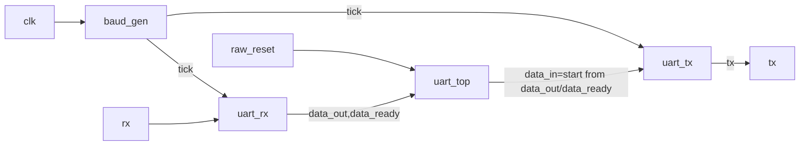

# UART serial loopback RTL
Synchronous UART receive-to-transmit loopback implemented in SystemVerilog.

## Specifications

| Parameter | Value |
| --- | --- |
| Frame format | 8N1 (1 start, 8 data, 1 stop) |
| Baud setting | 9600 bps (`BAUD_DIV = 5208`) |
| System clock | 50 MHz (`clk`) |
| Reset interface | `raw_reset` input, internal `reset = ~raw_reset` |
| Top-level ports | `clk`, `raw_reset`, `rx`, `tx` |
| Loopback path | `data_out` from `uart_rx` is assigned to `data_in` for `uart_tx` |
| FPGA/board target | TBD (part/board not specified in `fpga/uart.qsf`) |
| Resource estimate | TBD (no synthesis/fitter report in repository) |

## Block diagram



## Directory layout

```text
.
├── fpga
│   └── uart.qsf
├── optimisation
│   └── uart_top.sdc
├── sim
│   ├── uart_tb.sv
│   └── uart_tx_tb.sv
├── src
│   ├── baud_gen.sv
│   ├── uart_rx.sv
│   ├── uart_top.sv
│   └── uart_tx.sv
├── dump.vcd
├── uart_tb.vcd
├── uart_test
└── uart_top_test
```

## Build & program

1. Open Quartus Prime and create/open a project rooted at this repository.
2. Add `src/*.sv` as design files.
3. Set `uart_top` as the top-level entity.
4. Import assignments from `fpga/uart.qsf` and timing constraints from `optimisation/uart_top.sdc`.
5. Run Analysis & Synthesis, then Fitter, then Assembler (full compile).
6. Program the device using Quartus Programmer and a USB-Blaster connection.

## Usage

```bash
minicom -D /dev/ttyUSB0 -b 9600
```

Expected behavior: bytes received on `rx` are decoded by `uart_rx` and sent back on `tx` by `uart_tx`.

## Configuration

`uart_top` instantiates `baud_gen` with `.BAUD_DIV(5208)`. To change baud rate or clock, update this
divider with:

```text
BAUD_DIV = CLOCK_HZ / BAUD_RATE
```

Example: `50_000_000 / 9600 = 5208.33`, implemented as integer divider value `5208`.

## License

MIT
